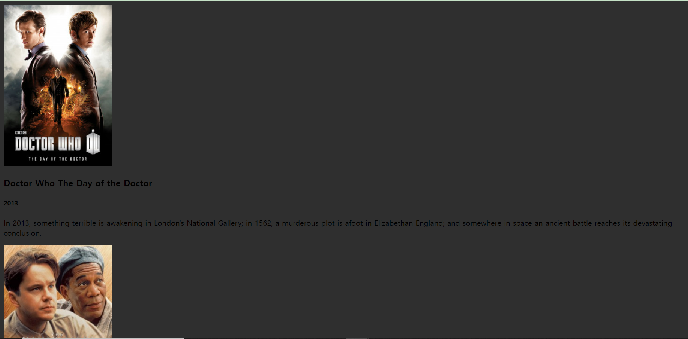
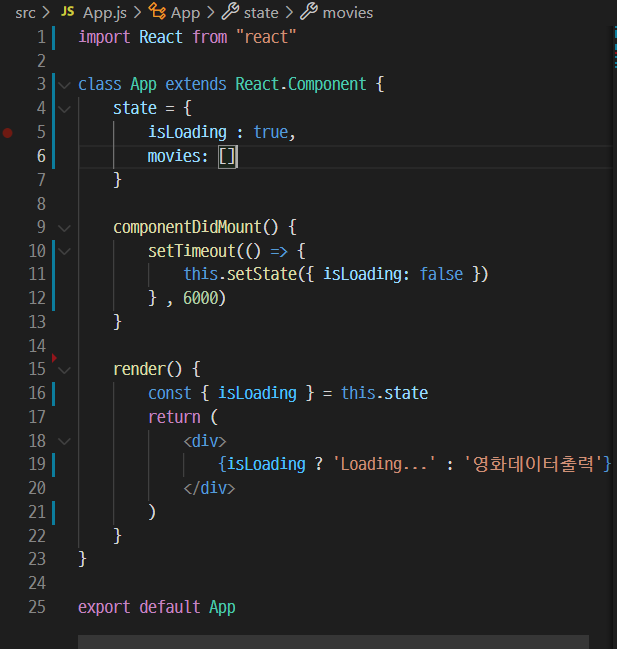
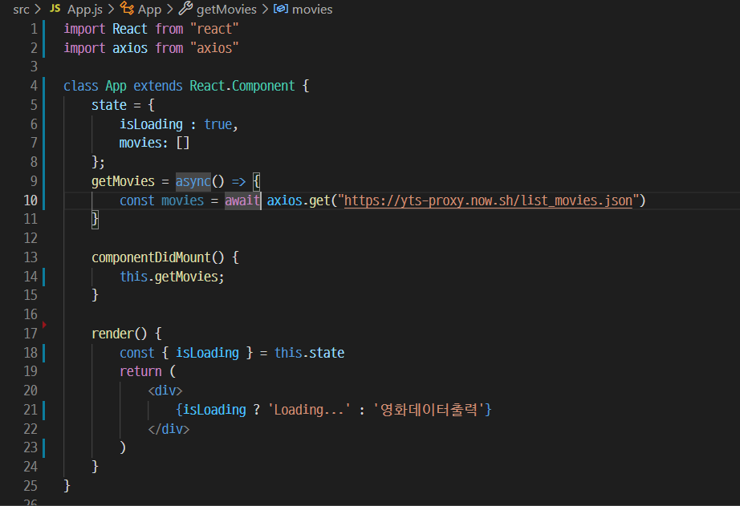
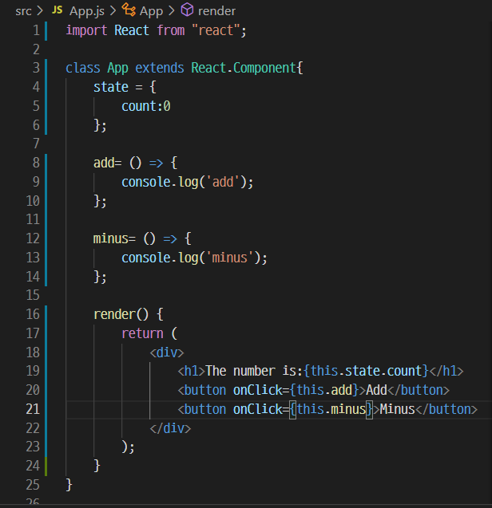
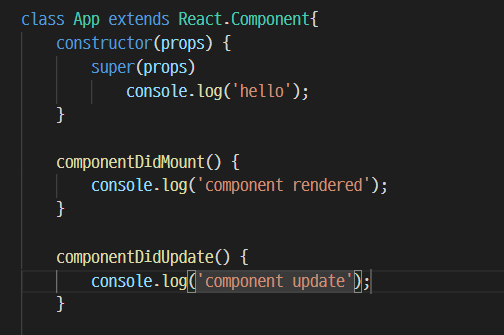

# 최기룡 [201840231]

## [10월 13일]
### 오늘 배운 내용 요약(리액트)

1. 영화 데이터 화면에 그리기
  - 객체에 있는 movies 키에 접근하기
    - ES6를 사용하여 구조 분해 할당 방법 사용
  - moive state에 영화 데이터 저장
    - this.setState({movies:movies})와 같이 작성하여 state에 영화 데이터 저장 -> console 부분 삭제
    - ES6에서는 객체의 키와 대입할 변수의 이름이 같다면 코드를 축약할 수 있다. -> this.setState({movies:movies}) -> this.setState({movies})로 수정
  - isLoading state를 true에서 false로 업데이트하기
    - isLoading state의 값을 true에서 false로 업데이트
  ___

2. Movie 컴포넌트 만들기
    - src 폴더에 새로 Movie.js 파일 만들기 -> 컴포넌트 생성(prop-types 사용)
  ```javascript
    import PropTypes from 'prop-types';
    function Movie() {
      return <h1></h1>;
    }

    Movie.propTypes = {};

    export default Movie;
  ```
  ___

  - Movie.propTypes 작성하기
    - id 값 추가(자료형 : number, isRequired)
    - 자료형이 string으로 year,title,summary,poster를 각각 추가
    - 아래 코드 내용 추가

  ``` javascript
    id : PropTypes.number.isRequired,
    year : PropTypes.string.isRequired,
    title : PropTypes.string.isRequired,
    summary : PropTypes.string.isRequired,
    poster : PropTypes.string.isRequired
  ```
  ___
  - axios 수정 : 주소뒤에 sort_by=rating을 추가해서 평점을 내림차순으로 보여주게 변경
  ``` javascript
  await axios.get('http://yts-proxy.now.sh/list_movies.json?sort_by=rating');
  ```
  ___
- Movie 컴포넌트에 props 추가하고 출력해보기
  - 컴포넌트에 위에서 추가한 id,year,title,summary,poster를 받아 출력하게 할 수 있도록 수정
  - 먼저 title만 출력하도록 수정
```javascript
function Movie({id,title,summary,year,poster}){
  return <h4>{title}</h4>
}
```
___
- App 컴포넌트에서 Movie 컴포넌트 그리기
  - App 컴포넌트에서 영화데이터출력부분을 출력하고 있는 자리에 movies.map()을 사용하여 Movie 컴포넌트를 반환하도록 수정
``` javascript
import Movie from './Movie';
// ··· 중간 생략
const {isLoading, movies } = this.state;
return <div>{isLoading? 'Loading...' : movies.map((movie) => {
  console.log(movie);
  return;
})}</div>
```
___
- Movie 컴포넌트에 props 전달하기
  -앞서 Movie 컴포넌트에 id,year,title,summary,poster를 isRequired로 설정했기에 모두 무조건 props에 전달해야함
  - 대부분 props의 이름은 노마드 코더 영화 API와 같게 만들었기에 poster props의 키 이름은 movies.medium_cover_image로 작성해야함
```javascript
return (
  <Movie
  id={movie.id}
  year={movie.year}
  title={movie.title}
  summary={movie.summary}
  poster={movie.medium_cover_image}/>
)
```
- 평점순으로 나열 되어있는지 확인
___
- keyprops 추가하기
  - console.log는 더이상 사용하지 않으니 삭제
```javascript
<Movie
key={movie.id}
id={movie.id}
year={movie.year}
title={movie.title}
summary={movie.summary}
poster={movie.medium_cover_image}/>
```
___
3. 영화 앱 스타일링 하기 - 기초
  - div 태그와 section 태그를 이용해서 감싸기
  - 아래 코드로 수정
```javascript
return <section class="container">
{isLoading ? (
  <div class="loader">
  <span class="loader-text">Loading...</span>
  </div>
) : (
  <div class="movies">
  {movies.map(movie=> (
    // ··· 중간 생략
  ))}
  </div>
)}
</section>
```
___
- Movie 컴포넌트에서 html 추가하기
```javascript
//Movie.js
function Moive({ id, title,year,summary,poster}){
  retuen (
    <div class="movie-data">
      <h3 class="movie-title">{title}</h3>
      <h5 class="movie-year">{year}</h5>
      <p class="movie-summary">{summary}</p>
    </div>
  );
}
```
___
- 영화 포스터 이미지 추가하기
  - img 엘리먼트의 src 속성에는 poster props를, alt, title 속성에는 title props를 전달하여 추가
```javascript
//Movie.js
return (
  <div class="movie">
  
  </div>
)
```
- 코드 완성 후 id가 필요하지 않은 걸 알게 되었으니 id props 삭제
___
- css 파일을 생성하여 꾸미기
  - App.js 파일과 Movie.js 파일에 css 파일을 생성 후 임포트하여 style 적용
```javascript
//App.js
import'./App.css';
//Movie.js
import'./Movie.css';
```
```css
//App.css
body{ background-color : #2f2f2f; }
```
**10월 13일자 최종화면**


## [10월 6일]
### 오늘 배운 내용 요약(리액트)

1. 로딩상태 출력

 - App.js를 새로 만들어 준다.

 - state를 선언하고, isLoading키 생성 후에 키 값을 true로 설정 -> 아직 데이터가 없기 때문에 true로 세팅

 - 삼항연산자를 사용해서 isLoading이 true면 Loading을 출력하고 false라면 영화데이터출력을 출력한다

___
 2. 로딩현상 구현

 - setTimeout() 함수의 첫 번째 인자는 실행할 함수이고, 두 번째 인자로 전달한 값은 지연시간이다. -> 두 번째 인자 시간만큼 지난 후 첫 번째 인자의 함수 실행

 - 시간의 단위는 msec

 - componentDidMount()함수를 사용하여 render()함수가 먼저 수행되게 하고 그 이후 setTimeout()함수가 실행되도록 한다.
 

___

 3. 영화 API 사용해보기

 - axios 설치하기 -> 설치 후 package.json에서 확인 가능
 >npm install axios

 - yts.lt/api 사이트에서 영화 데이터 살펴보기

 - 구글 웹 스토어 -> JSON Viewer 설치

 - 노마드 코더 영화 API를 사용 -> YTS의 endpoint/list_movies.json을 쓰려면 yts-proxy.now.sh에 /list_movies.json를 붙이면 된다.

 - 노마드 코더 영화 API를 영화 앱에서 호출하기
  - axios import 추가
  - setTimeout() 함수를 지우고 axios로 API호출

 - axios 동작 확인
  - 코드 작성 후 영화 앱을 새로고침 하고 network 탭을 들어간다면 list_movies_json이라고 나와있다. -> axios가 동작한다는 뜻

 - getMovies() 함수 기다린 다음, axios.get() 함수가 반환 데이터 잡기
  - getMovies() 함수를 만들고 그 함수 안에서 axios.get이 실행되도록 코드 작성

 - getMovies()에 async 붙이고, axios.get()에 await 붙이기
  - getMovies()는 시간이 필요하다고 자바스크립트에 전달하려면 async를 앞에 붙이고 axios.get() 앞에 await을 붙이면 된다.

 - async라는 키워드는 자바스크립트에게 getMovies() 함수가 비동기라고 알려주는 역할

 - await은 getMovies()함수 내부의 axios.get()의 실행 완료를 기다렸다가 끝나면 계속진행하라고 알려주는 역할
 
___

4. 영화 데이터 화면에 그리기

- console.log() 함수로 영화 데이터 출력하기
  - axios.get()으로 잡은 영화 데이터가 movies 변수 안에 들어있는것을 출력
  - console탭에 데이터들이 출력된다.

- 객체에 있는 moives 키에 접근하기
  - console.log() 함수에 있는 movies 옆에 data.data.movies 코드 작성-> 원하는 데이터를 추출하기 위함

## [9월 29일]
### 오늘 배운 내용 요약(리액트)

1. master branch를 main branch로 변경

 - 버전 2.28이상인지 확인
 >git --version
 >git config --global init.defaultBranch main

 - config 확인. 우선순위는 Local>Global>System순서, system은 바뀌지 않음

>git config --system --list
git config --global --list
git config --local --list
모든 설정 : git config --list

 - 기본 브랜치 변경
>git branch -m master main

___

2. React Project clone하기

 - git clone 주소

 - cd 프로젝트 폴더

 - npm install

 - npm start

 ___

 3. 상대경로 이미지 삽입 방법

  - public 폴더에 images폴더를 생성 -> 필요한 곳에 형태로 태그 작성

  ___

  4. 음식 앱에 prop-types 도입하기

  - 음식 데이터에 rating 추가하기
    - foodLike 배열의 각 요소에 rating(평점) 추가
    - 자료형은 number

  - prop-types 설치하기
    - npm install prop-types
    - package.json 파일을 열어 dependencis키에 prop-types가 등록되어 있는지 확인
    - **import PropTypes from 'prop-types'**를 파일 맨 위에 추가

  - Food.propTypes 작성하기
    -  rating : PropTypes.string.isRequired 라고 작성을 하면 콘솔창에 오류 발생 ->  rating : PropTypes.**number**.isRequired로 바꿔주기
    - isRequired는 반드시 필요하다는 뜻

___

5. state로 숫자 증감 기능 만들어 보기

- props는 정적인 데이터만 다룰 수 있음.
- state는 동적인 데이터를 다루기 위해 사용됨.
- state는 class형 컴포넌트에서 사용
- 기존의 App.js -> 04-App.js로 변경 후 새로운 App.js 생성
<br/>

- 클래스형 컴포넌트 작성
```javascript
import React from 'react';

class App extends React.Component {
  //App 클래스는 React.Component는 상속받는다.
  //React.Component는 500여 줄이 넘는 코드로 여러가지 기능이 구현되어 있기 때문에 사용하기 편리하다.
  //import를 할때 '{Component}'를 써주면 extends에서 'React'을 생략할 수 있다.
}

export default App;
```

<br />

- render() 함수 사용
  - App 컴포넌트가 JSX를 반환해야 하지만 class형 컴포넌트에서는 바로 return 사용 x -> render() 함수 내에서 사용
<br />

- state 정의하기
  - state는 반드시 class형 컴포넌트 안에서, 소문자를 사용해야 한다.
  - class안에 state={}라고 작성하여 state를 정의한다
  - count 값을 0으로 지정, render함수에서 this.state.count를 출력
<br />

- count state값 변경하기
  - Add, Minus 버튼 추가
  - div 태그로 묶기, 버튼을 누를때 마다 add와minus 출력
  - 화살표함수 사용,onClick속성을 이용


___

6. 숫자 증감 기능 만들기

- 앞서 사용한 코드에서 console.log를 삭제하고 this.state.count로 바꿔서 결과를 보면 경고가 나타남. => setState()함수를 사용해야 해결
>this.setState({count : 1}) 또는
>this.setState({count : -1})

- 이것또한 지속적인 증감은 아님
>this.setState(current => {count:current.count +1}) 또는
>this.setState(current => {count:current.count -1})

<br />

- 생성자(constructor)란 무엇인가
  - constructor는 Component를 생성할 때 state 값을 초기화하거나 메서드를 바인딩할 때 사용
  - 자바스크립트에서 super는 부모클래스 생성자의 참조한다는 의미
  - 자바스크립트는 언어적 제약사항으로 생성자에서 super를 호출하기 전에는 this를 사용할 수 없고 **super를 먼저 호출**해야 this 사용가능
  - 생성자 내에서는 setState를 사용하지 않고 this.state를 사용하여 state 초기값 할당
  - 생성자 내에서는 외부 API를 호출할수 없으므로 필요하다면 componentDidMount()를 사용

- componentDidMount() 함수
  - componentDidMount()함수를 선언하고, console.log()함수를 작성하여 실행해보면 render()함수 실행 직후인 것을 확인 가능하다.

- componentDidUpdate() 함수
  - 동일한 방법으로 Update로 바꿔서 실행을 해보면 console에 바로 출력이 되지 않고 버튼을 클릭해서 화면을 업데이트하면 componentDidUpdate()함수가 같이 실행된다.



## [9월 15일]
### 오늘 배운 내용 요약(리액트)

1. 리액트 기초 개념: JSX

 - 컴포턴트는 자바스크립트와 HTML을 조합한 JSX라는 문법을 사용해서 만든다
 
 - JSX의 문법은 JS와 HTML 문법의 조합한 것으로 사용하다 보면 자연스럽게 익힐 수 있다

 2. Potato 컴포넌트 만들기

 - 컴포넌트를 작성할 때 중요한 규칙은 대문자로 시작해야한다는 점.

 - 컴포넌트를 만든 뒤 컴파일을 하면 오류가 발생 -> '인접한 JSX 요소는 반드시 하나의 태그로 감싸야 합니다.' -> 두 개의 컴포넌트를 그리려해서 오류가 발생 -> Potato 컴포넌트를 App 컴포넌트 안에 넣어야함

 - potato.js 파일을 삭제하고나서도 이전처럼 정의한 내용이 나오게 하려면 App.js 파일에도 똑같이 다시 적으면 가능.


 - 

 ___

 3. props

 - 컴포넌트에서 컴포넌트로 전달하는 데이터, 함수의 매개변수 역할

 - 만약 영화 앱을 만들려고 할 때 여러개의 영화가 있다면 리스트의 값이 모두 달라야 할텐데 컴포넌트를 단순히 붙여넣기 불가능. -> 이때 사용하는 것이 props

___

 4. 음식 주제 리액트 앱 만들기

 - <Food />를 <Food fav="kimchi" />로 수정 -> 이것이 props를 이용하여 컴포넌트에 데이터를 보내는 방법

 - props의 이름이 fav이고 fav에 kimchi라는 값을 넣어 Food컴포넌트에 전달한 것

 - props의 전달 데이터는 문자열인 경우를 제외하면 모두 중괄호로 감싸야 함.

 - props를 사용하기 -> function Food(*props*)추가
 console.log(props)도 추가 -> 화면은 변화가 없음 -> 이유는 console.log() 함수는 개발자 도구의 console에만 영향을 주기 때문

 - kimchi를 출력하려면 <h1>I like {props.fav}</h1>을 입력.

 

 >구조 분해 할당으로 props 사용하기
 데이터의 개수가 많아지면 구조 분할 할당을 사용하는 것이 편리
 아래 두 가지 방법 중 아무거나 사용 가능

 ```javascript
 import React from 'react'

 function Food(props){
     { fav } = props;
     return <h1> I like {fav} </h1>;
 }

 function Fodd({ fav }) {
     return <h1> I like {fav}</h1>;
 }
 ```

___

5. 효율적으로 컴포넌트 출력하는 방법

- App.js 에서 비효율적은 컴포넌트 삭제

- foodILike라는 변수의 빈 배열 생성

- 음식 데이터 코드 작성


___

6. map() 함수

- 앞서 만든 foodILike에 있는 데이터에 사용되는 함수 -> map()

- 특징 1 : map() 함수의 인자로 전달한 함수는 배열 friends의 원소를 대상으로 실행된다는 것.

- 특징 2 : 함수가 반환한 값이 모여 배열이 되고, 그 배열이 map() 함수의 반환갑싱 된다.

- map() 함수로 Food 컴포넌트 여러개 출력 -> div 안쪽에 {foodILike.map(dish => (<Food name={dish.name} />))})} 작성. -> dish에 원소가 하나씩 넘어 오는 것을 name props에 전달하는 코드

- 이미지 출력하기 -> name 대신 picture props를 추가하고 dish.image를 추가 -> Food에  태그 추가

- renderFood 함수로 수정하여 리액트와 map() 함수가 어떤 상호작용을 하는지 알아봄.

- renderFood 함수를 사용하였더니 복잡한 배열이 출력되고 있었음 -> 다시 원래대로 복귀

___
7. key props 추가

- console 창의 경고 메시지를 보면, "key" prop을 가져야한다는 메시지가 존재 -> 리액트의 원소들은 유일해야 하는데 리액트 원소가 리스트에 포함되면서 유일성 x

- 이를 해결하기 위해 데이터에 id값을 추가 -> 경고 메시지가 사라짐
 
 


## [9월 8일]
### 오늘 배운 내용 요약(리액트)

1. create-react-app 설치

 - create-react-app을 설치하면 명령어 1줄만 입력해서 리액트 개발 가능 -> 프로젝트 구조 작업, 설정 작업등을 자동으로
 진행해주는 도구

 - npx create-react-app 폴더이름

 - node_modules 폴더는 파일이 많으니 .gitignore 파일에 제외시키도록 해야 한다.
___
 2. 리액트 앱 실행

 - npm start를 터미널에 입력

 3. 파일 삭제

 - src 폴더 안에 App.js, index.js를 제외하고 삭제, 상위 폴더에서 package-lock.json 삭제

 - index.js 파일 수정 -> index.css , serviceWorker, strictmode, /strictmode, //~unregister까지 삭제

 - app.js 파일 수정 -> 맨 윗줄 imprt React from 'react' 작성 후 밑 두줄 삭제, function App() { return 뒤 소괄호 삭제, "App" /작성 및 그 뒷줄 세미콜론 전까지 삭제

## [9월 1일]
### 오늘 배운 내용 요약(리액트)

1. 클론 코딩이란?

 - 실제로 존재하는 사이트나 앱의 코드를 보며 그대로 따라 만들면서 , 해당 언어나 기술을 습득하는 학습 방법

 - 완성된 프로젝트를 클론해서 하나씩 완성해 가는 실습위주의 학습

 - GitHub의 수많은 오픈소스들이 학습의 도구가 된다.

2. 클론 코딩의 부작용 및 학습 방법

 - 실력이 늘지 않는 부작용이 있음.

 - 완성된 코드를 맹목적으로 카피해서 사용 x

 - 모르는 내용이나 코드가 있으면 질문하거나 찾아보기

 - 클론 한 코드를 그대로 따라하지 말고 학습자의 개성 살리기

 - 주석을 자세하게 달기

 - 학습한 내용 문서화 하기

 - 지속적으로 커밋 후 포트폴리오 제작

 - 학습한 내용을 기반으로 한 다른 프로젝트를 스스로 기획 & 개발
