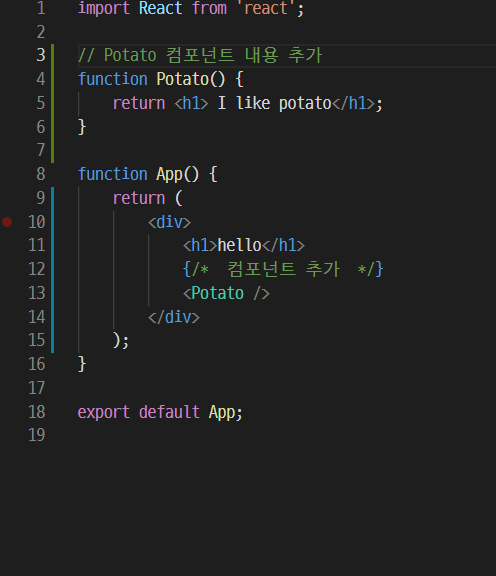
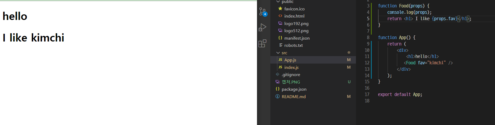
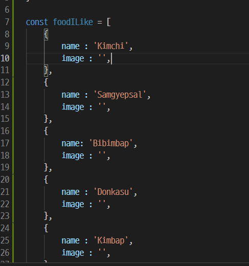

# 최기룡 [201840231]

## [9월 15일]
### 오늘 배운 내용 요약(리액트)

1. 리액트 기초 개념: JSX

 - 컴포턴트는 자바스크립트와 HTML을 조합한 JSX라는 문법을 사용해서 만든다
 
 - JSX의 문법은 JS와 HTML 문법의 조합한 것으로 사용하다 보면 자연스럽게 익힐 수 있다

 2. Potato 컴포넌트 만들기

 - 컴포넌트를 작성할 때 중요한 규칙은 대문자로 시작해야한다는 점.

 - 컴포넌트를 만든 뒤 컴파일을 하면 오류가 발생 -> '인접한 JSX 요소는 반드시 하나의 태그로 감싸야 합니다.' -> 두 개의 컴포넌트를 그리려해서 오류가 발생 -> Potato 컴포넌트를 App 컴포넌트 안에 넣어야함

 - potato.js 파일을 삭제하고나서도 이전처럼 정의한 내용이 나오게 하려면 App.js 파일에도 똑같이 다시 적으면 가능.


 - 

 ___

 3. props

 - 컴포넌트에서 컴포넌트로 전달하는 데이터, 함수의 매개변수 역할

 - 만약 영화 앱을 만들려고 할 때 여러개의 영화가 있다면 리스트의 값이 모두 달라야 할텐데 컴포넌트를 단순히 붙여넣기 불가능. -> 이때 사용하는 것이 props

___

 4. 음식 주제 리액트 앱 만들기

 - <Food />를 <Food fav="kimchi" />로 수정 -> 이것이 props를 이용하여 컴포넌트에 데이터를 보내는 방법

 - props의 이름이 fav이고 fav에 kimchi라는 값을 넣어 Food컴포넌트에 전달한 것

 - props의 전달 데이터는 문자열인 경우를 제외하면 모두 중괄호로 감싸야 함.

 - props를 사용하기 -> function Food(*props*)추가
 console.log(props)도 추가 -> 화면은 변화가 없음 -> 이유는 console.log() 함수는 개발자 도구의 console에만 영향을 주기 때문

 - kimchi를 출력하려면 <h1>I like {props.fav}</h1>을 입력.

 

 >구조 분해 할당으로 props 사용하기
 데이터의 개수가 많아지면 구조 분할 할당을 사용하는 것이 편리
 아래 두 가지 방법 중 아무거나 사용 가능

 ```javascript
 import React from 'react'

 function Food(props){
     { fav } = props;
     return <h1> I like {fav} </h1>;
 }

 function Fodd({ fav }) {
     return <h1> I like {fav}</h1>;
 }
 ```

___

5. 효율적으로 컴포넌트 출력하는 방법

- App.js 에서 비효율적은 컴포넌트 삭제

- foodILike라는 변수의 빈 배열 생성

- 음식 데이터 코드 작성



___

6. map() 함수

- 앞서 만든 foodILike에 있는 데이터에 사용되는 함수 -> map()

- 특징 1 : map() 함수의 인자로 전달한 함수는 배열 friends의 원소를 대상으로 실행된다는 것.

- 특징 2 : 함수가 반환한 값이 모여 배열이 되고, 그 배열이 map() 함수의 반환갑싱 된다.

- map() 함수로 Food 컴포넌트 여러개 출력 -> div 안쪽에 {foodILike.map(dish => (<Food name={dish.name} />))})} 작성. -> dish에 원소가 하나씩 넘어 오는 것을 name props에 전달하는 코드

- 이미지 출력하기 -> name 대신 picture props를 추가하고 dish.image를 추가 -> Food에  태그 추가

- renderFood 함수로 수정하여 리액트와 map() 함수가 어떤 상호작용을 하는지 알아봄.

- renderFood 함수를 사용하였더니 복잡한 배열이 출력되고 있었음 -> 다시 원래대로 복귀

___
7. key props 추가

- console 창의 경고 메시지를 보면, "key" prop을 가져야한다는 메시지가 존재 -> 리액트의 원소들은 유일해야 하는데 리액트 원소가 리스트에 포함되면서 유일성 x

- 이를 해결하기 위해 데이터에 id값을 추가 -> 경고 메시지가 사라짐
 
 


## [9월 8일]
### 오늘 배운 내용 요약(리액트)

1. create-react-app 설치

 - create-react-app을 설치하면 명령어 1줄만 입력해서 리액트 개발 가능 -> 프로젝트 구조 작업, 설정 작업등을 자동으로
 진행해주는 도구

 - npx create-react-app 폴더이름

 - node_modules 폴더는 파일이 많으니 .gitignore 파일에 제외시키도록 해야 한다.
___
 2. 리액트 앱 실행

 - npm start를 터미널에 입력

 3. 파일 삭제

 - src 폴더 안에 App.js, index.js를 제외하고 삭제, 상위 폴더에서 package-lock.json 삭제

 - index.js 파일 수정 -> index.css , serviceWorker, strictmode, /strictmode, //~unregister까지 삭제

 - app.js 파일 수정 -> 맨 윗줄 imprt React from 'react' 작성 후 밑 두줄 삭제, function App() { return 뒤 소괄호 삭제, "App" /작성 및 그 뒷줄 세미콜론 전까지 삭제

## [9월 1일]
### 오늘 배운 내용 요약(리액트)

1. 클론 코딩이란?

 - 실제로 존재하는 사이트나 앱의 코드를 보며 그대로 따라 만들면서 , 해당 언어나 기술을 습득하는 학습 방법

 - 완성된 프로젝트를 클론해서 하나씩 완성해 가는 실습위주의 학습

 - GitHub의 수많은 오픈소스들이 학습의 도구가 된다.

2. 클론 코딩의 부작용 및 학습 방법

 - 실력이 늘지 않는 부작용이 있음.

 - 완성된 코드를 맹목적으로 카피해서 사용 x

 - 모르는 내용이나 코드가 있으면 질문하거나 찾아보기

 - 클론 한 코드를 그대로 따라하지 말고 학습자의 개성 살리기

 - 주석을 자세하게 달기

 - 학습한 내용 문서화 하기

 - 지속적으로 커밋 후 포트폴리오 제작

 - 학습한 내용을 기반으로 한 다른 프로젝트를 스스로 기획 & 개발
