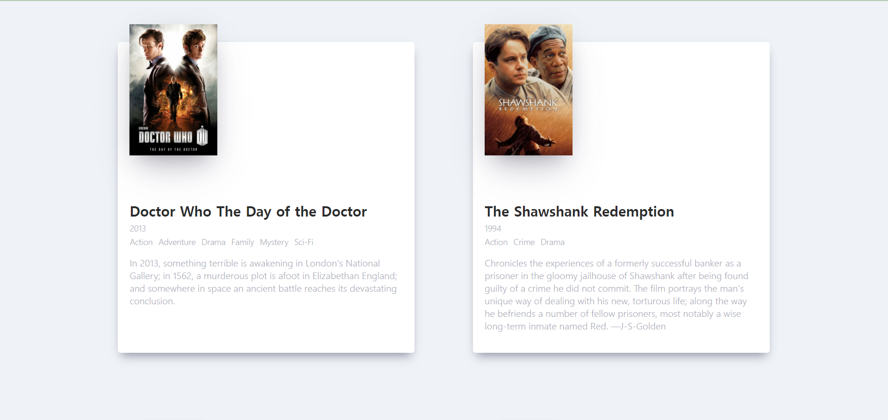

# 최기룡 [201840231]

## [11월 10일]
### 오늘 배운 내용 요약(리액트)

1. 영화 앱 배포하기
  - package.json 수정하기
```javascript
//package.json
"scripts": {
    "start": "react-scripts start",
    "build": "react-scripts build",
    //추가
    "predeploy": "npm run build",
    "deploy": "gh-pages -d build"
  },
  // 중간 생략
"development": [
      "last 1 chrome version",
      "last 1 firefox version",
      "last 1 safari version"
    ]
  },
  //추가
  "homepage": "https://kirong99.github.io/movie_app_2021"
```
___
  - 이후 npm install gh-pages 설치
  - 배포 명령어 : npm run deploy **(한 번 배포하고 난 뒤에도 다시 명령어를 실행한다면 재배포 가능)**
  - 배포 이후 bulid 폴더가 생긴 것 확인 가능 -> 안쪽 index.html을 통해 어디에서도 실행할 수 있음 -> 
    **index.html 안에 있는 css,js 파일의 경로 앞부분을 ./static으로 수정해주어야 한다.**

2. React의 특징
  - 상호작용이 많은 UI 개발에 적합하다.
  - 컴포넌트 로직은 JavaScript로 작성한다.
  - 캡슐화된 컴포넌트로 개발되어 재사용이 용이하다.
  - DOM과는 별개로 상태를 관리할 수 있다.
  - 기술 스택의 나머지 부분에는 관여하지 않는다.
  - 기존 코드와 별개로 개발이 가능하다.
  - React Native을 이용하면 모바일 앱도 만들 수 있다.

3. CDN & LINK
  - CDN : Content Delivery Network 또는 Content Distribution Network
  - CORS : 특정 헤더를 통해서 브라우저에게 원 출처에서 실행되고 있는 웹 애플리케이션이 다른 출처에 원하는 리소스에 접근할 수 있는 권한이 있는지 알려주는 매커니즘
  - Babel: 이전 저번과 호환되는 JavaScript 버전으로 변환하는 데 주로 사용되는 무료 오픈 소스 JavaScript 트랜스 컴파일러

4. 컴포넌트
  - React component에서 render() 메소드를 사용하는 예제
  - render() 메소드는 데이터를 입력받아 화면에 반환하는 역할을 한다.
  - 컴포넌트로 전달된 데이터는 render() 안에서 this.props를 통해 접근 가능

## [11월 3일]
### 오늘 배운 내용 요약(리액트)

1. 네비게이션 만들기
  - Navigation 컴포넌트 만들기
    - components 폴더에 Navigation.js 파일 생성
```javascript
import React from 'react';

function Navigation() {
    return(
        <div>
            <a href="/">Home</a>
            <a href="/about">About</a>
        </div>
    )
}

export default Navigation;
```
___
  - Navigation 컴포넌트 App 컴포넌트에 포함시키기
```javascript
//App.js
import Navigation from "./components/Navigation"

<HashRouter>
     <Navigation />
// ''' 생략           
</HashRouter>
```
  - Home 링크가 왼쪽 상단에 만들어짐, 링크를 누르고 작동되는지 확인
___
  - a 엘리먼트를 Link 엘리먼트로 바꾸기
```javascript
//Navigation.js
import { Link } from 'react-router-dom';

function Navigation() {
    return(
        <div>
            <Link to="/">Home</Link>
            <Link to="/about">About</Link>
        </div>
    )
}
```
  - link로 바꾼 뒤에 about도 잘 작동하는지 확인
___
  - Navigation.css 파일 생성 후 작성
```css
.nav{
    z-index: 1;
    position: fixed;
    top: 50px;
    left: 10px;
    display: flex;
    flex-direction: column;
    background-color: white;
    padding: 10px 20px;
    box-shadow: 0 13px 27px -5px rgba(50,50,93,0.25),
     0 8px 16px -8px rgba(0,0,0,0.3),
     0 -6px 16px -6px rgba(0,0,0,0.025);
    border-radius: 5px;
}

@media screen and (max-width: 1090px) {
    .nav{
        left: initial;
        top: initial;
        bottom : 0px;
        width: 100%;
    }
}   

.nav a{
    text-decoration: none;
    color: #0008fc;
    text-transform: uppercase;
    font-size: 12px;
    text-align: center;
    font-weight: 600;
}

.nav a:not(:last-child){
    margin-bottom: 20px;
}
```
  - Navigation.js에 임포트시키기
  - div classname 명시
```javascript
import './Navigation.css';
<div className="nav">
```
___

2. 영화 상세 정보 기능 만들어보기
  - route props 살펴보기
    - console.log를 통해 about으로 어떤 props가 넘어오는지 체크.
```javascript
//About.js
function About(props) {
    console.log(props)
```
  - route props에 마음대로 데이터를 담아 보내줄 수 있다는 사실을 알게됨.
___
  - route props에 데이터 담아 보내기
```javascript
//Navigaion.js
<Link to={{ pathname: '/about', state: { fromNavigation: true }}}>About</Link>
```
  - console창을 들어가서 location을 펼쳐보면 state에 값이 들어간 것을 확인할 수 있다.
  - 확인했다면 다시 전 코드로 돌려놓기
___
  - Movie 컴포넌트에 Link 컴포넌트 추가하기
```javascript
//Movie.js
import { Link } from 'react-router-dom';
/// 중간 생략
<div className="movie">
  <Link
    to={{
    pathname: '/movie-detail',
    state: {year, title, summary, poster, genres },
       }}
  >
'''중간생략
                </div>
            </Link>
        </div>
```
  - Link를 추가하고나서 영화 카드를 누르면 /movie-detail로 이동하는 것을 확인 가능
___
  - Detail 컴포넌트 만들기
    - routes폴더에 Detail.js 만들기
```javascript
import React from 'react';

function Detail(props) {
    console.log(props);
    return <span>hello</span>;
}

export default Detail;
```
___
  - 만든 이후 App.js에 detail 컴포넌트를 임포트하고 route 컴포넌트에서 detail 컴포넌트를 그려주도록 수정
```javascript
//App.js
import Detail from './routes/Detail';
<Route path="/movie-detail" component={Detail}>
```
  - 이후 영화 카드를 눌러서 hello라는 문장이 보이고, console창에 가서
  location에서 state를 movie 컴포넌트에서 link 컴포넌트를 보내준 데이터가 들어있다.
___

3. 리다이렉트 기능 만들어 보기
  - 아무 영화 카드로 이동해서 console 탭을 열어보면 history에 출력된 값인 push,go,goBack,goForward키 -> URL 변경 함수
  - Detail 컴포넌트 클래스형 컴포넌트로 변경하기
```javascript
import React from 'react';

class Detail extends React.Component{
    componentDidMount() {
        const {location, history} = this.props;
        if (location.stat === undefined) {
            history.push('/');
        }
    }

    render() {
        return <span>hello</span>;
    }
}

export default Detail;
```
  - 수정 후 앱을 실행하여 /movie-detail로 이동하면 Home으로 돌아오는 것을 확인 가능
___
  - 영화 제목 출력하기
```javascript
//Detail.js
render() {
  const { location } = this.props;
  return <span>{location.state.title}</span>
}
```
___
  - 다시 /movie-detail로 돌아가면 오류 발생 -> render함수에도 리다이렉트 코드를 추가해야함
```javascript
//Detail.js
render() {
  const { location } = this.props;
  if (location.state) {
    return<span>{location.state.title}</span>;
  } else {
    return null;
  }
}
```
  - location.state가 없으면 render()함수가 null을 반환하도록 수정한 것.
  -> 이로써 문제없이 실행가능.


## [10월 27일]
### 오늘 배운 내용 요약(리액트)

1. 영화 앱 전체 모습 수정하기
  - App.css 코드 전체 삭제
  - Movie 컴포넌트에 genres props 넘겨주기
```javascript
//Movie.js
function Movie({ title, year, summary, poster , genres})
'''' //중간 생략
Movie.prorTypes= {
''''
poster: PropTypes.string.isRequired,
genres: PropTypes.arrayOf(PropTypes.string).isRequired,
};
```
```javascript
//App.js
<div class="movies">
  //생략
  <Movie
    //생략
    poster={movie.medium.cover_image}
    genres={moive.genres}
  />
```
  - 위 코드 수정
  - class -> className으로 수정
___

2. 영화 장르 출력하기
  - map함수를 사용하여 영화 장르 출력하기
```javascript
<h5 className="movie-year">
<ul className="movie-genres">
    {genres.map((genre)=> {
    return <li className="movie-genre">{genre}</li>;
    })}
</ul>
```
  - 위 코드 추가
  - **장르 출력 화면**


___

  - li 엘리먼트에 key props 출력하기
```javascript
<ul className="movie-genres">
    {genres.map((genre, index)=> {
    return <li key={index} className="movie-genre">
    {genre}
           </li>;
    })}
</ul>
```
- 위 코드 추가
___

3. 영화 앱 멋지게 스타일링하기
  - App.css 파일 수정
```css
* {
    box-sizing: border-box;
}

body {
    margin: 0;
    padding : 0;
    font-family: -apple-system, BlinkMacSystemFont, 'SegoeUI', Roboto, Oxygen, Ubuntu, Cantarell, 'Open Sans', 'Helventica Neue', sans-serif;
    background-color: #eff3f7;
    height: 100%;
}
```

  - Movie.css 파일 수정
```css
.movies .movie{
    background-color:white;
    margin-bottom: 70px;
    font-weight: 300;
    padding: 20px;
    border-radius:5px;
    color: #adaeb9;
    box-shadow: 0 13px 17px -5px rgba(50,50,93,0.25), 0 8px 16px -8px rgba(0,0,0,0.3), 0 -6px 16px -6px rgba(0,0,0,0.025);
}

.moives .movie a{
    display: grid;
    grid-template-columns: minmax(150px, 1fr) 2fr;
    grid-gap: 20px;
    text-decoration: none;
    color: inherit;
}

.movie img {
    position: relative;
    top : -50px;
    max-width: 150px;
    width: 100%;
    margin-right: 30px;
    box-shadow: 0 30px 60px -12px rgba(50,50,93,0.25), 0 18px 36px -18px rgba(0,0,0,0.3), 0 -12px 36px -8px rgba(0,0,0,0.025);
}

.movie .moive-title, .movie .movie-year{
    margin: 0;
    font-weight: 300;
}

.movie .movie-title{
    margin-bottom: 5px;
    font-size: 24px;
    color: #2c2c2c;
}

.movie .movie-genres{
    list-style: none;
    padding: 0;
    margin: 0;
    display: flex;
    flex-wrap: wrap;
    margin: 5px 0px;
}

.movie-genres li, .movie .movie-year{
    margin-right: 10px;
    font-size: 14px;
}
```
___
  - 시놉시스 180자로 제한하기
``` javascript
//{summary} ->
{summary.slice(0,180)}...</p>
```
___

  - 영화 앱 제목 바꾸기
```javascript
//index.html
<title>Movie App</title>//로 수정
```

4. react-router-dom 설치 후 프로젝트 폴더 정리
  - react-router-dom 설치
  >npm install react-router-dom 명령어 실행
  - src 폴더 안에 components 폴더 생성 후 Movie.js, Movie.css 파일 이동
  - src 폴더 안에 routes 폴더 생성 후 About.js, Home.js 파일 생성
  - Home.js 수정하기(App.js를 복사해와서 수정)
```javascript
import React from 'react';
import axios from 'axios';
import Movie from '../components/Movie';
import './Home.css';

class Home extends React.Component {
  //생략
}

export default Home;
```
___

  - Home.css만들기(routes 폴더 안에)
```css
.container {
    height: 100%;
    display: flex;
    justify-content: center;
}

.loader {
    width: 100%;
    height: 100vh;
    display: flex;
    justify-content: center;
    align-items: center;
    font-weight: 300;
}

.movies {
    display: grid;
    grid-template-columns: repeat(2,minmax(400px, 1fr));
    grid-gap: 100px;
    padding: 50px;
    width: 80%;
    padding-top: 70px;
}

@media screen and (max-width: 1090px) {
    .movies {
        grid-template-columns: 1fr;
        width: 100%;
    }
}
```
___

  - App.js 수정하고 앱 실행해보기
```javascript
import React from "react"
import Home from "./routes/Home"
import "./App.css"

function App() {
    return <Home />;
}

export default App
```
  - **결과화면**

___
  
5. 라우터 만들어 보기
  - HashRouter와 Route 컴포넌트 사용하기
    - home을 임포트하는 코드는 잠시 지워두기
```javascript
//App.js
import { HashRouter, Route } from 'react-router-dom'

function App() {
    return (
        <HashRouter>
            <Route />
        </HashRouter>
    );
}
```
  - 화면에 아무것도 보이지 않고 주소창에 #이 추가된것이 정상
___

  - Route 컴포넌트에 path, component props 추가하기
```javascript
//App.js
import About from './routes/About'
function App() {
    return (
        <HashRouter>
            <Route path="/about" component={About} />
        </HashRouter>
    );
}
```

  - About.js 수정하기
```javascript
import React from 'react';

function About() {
    return <span> About this page: I built it because I love movies.</span>;
}

export default About;
```
  - 코드 수정 후 앱 주소창에 #뒤에 about을 추가한다면 내용이 보일 것.

___

  - Home 컴포넌트를 위한 Route 컴포넌트 추가
```javascript
//App.js
import Home from './routes/Home'
<HashRouter>
            <Route path="/" component={Home} />
```
- 코드 수정 후 실행을 시키면 기본 화면은 Home이 실행이 될것이고 주소에 보면 about으로 접속이 되었기에 같이 맨 밑에 출력되는 것을 볼 수 있다.
___

  - 라우터 자세히 살펴보기
```javascript
//App.js
function App() {
    return (
        <HashRouter>
            <Route path="/home">
                <h1>Home</h1>
            </Route>
            <Route path="/home/instroduction">
                <h1>instroduction</h1>
            </Route>
            <Route path="/about">
                <h1>About</h1>
            </Route>
        </HashRouter>
    );
}
```
  - 코드를 수정 후 실행한다면 주소가 **home**이라면 **home**이 출력, **home/instroduction**이라면 **home과 instroduction**이 출력, **about**은 **about**이 출력된다
___

  - App.js 원래대로 돌려놓기 -> 위에 코드 바로 전단계로 돌려놓기
  - Route 컴포넌트에 exact propts 추가해보기
```javascript
//App.js
<Route path="/" exact={true} component={Home} />
```

  - 위 코드 수정 -> 주소가 about이라면 about 컴포넌트만 출력되고 /인 경우에는 home 컴포넌트 출력
___

  - About.css 작성(routes 폴더에 About.css 생성)
```css
.about-container{
    box-shadow: 0 13px 27px -5px rgba(50,50,93,0.25), 0 8px 16px -8px rgba(0,0,0,0.3), 0 -6px 16px -6px rgba(0,0,0,0.025);
    padding: 20px;
    border-radius: 5px;
    background-color: white;
    margin: 0 auto;
    margin-top: 100px;
    width: 100%;
    max-width: 400px;
    font-weight: 300;
}

.about-container span:first-child {
    font-size: 20px;
}

.about-container span:last-child {
    display: block;
    margin-top: 10px;
}
```
  - 이후 about.js 수정
```javascript
//About.js
import React from 'react';
import './About.css'

function About() {
    return(
        <div className="about-container">
            <span>
                "Freedom is the freedom to say that two plus two make four. If that is granted, all else follows"
            </span>
            <span>- George Orwell, 1984</span>
        </div>
    );
}

export default About;

```
  - 코드를 실행하고 about을 주소에 입력하면 작성한 내용이 보일 것.
___


## [10월 13일]
### 오늘 배운 내용 요약(리액트)

1. 영화 데이터 화면에 그리기
  - 객체에 있는 movies 키에 접근하기
    - ES6를 사용하여 구조 분해 할당 방법 사용
  - moive state에 영화 데이터 저장
    - this.setState({movies:movies})와 같이 작성하여 state에 영화 데이터 저장 -> console 부분 삭제
    - ES6에서는 객체의 키와 대입할 변수의 이름이 같다면 코드를 축약할 수 있다. -> this.setState({movies:movies}) -> this.setState({movies})로 수정
  - isLoading state를 true에서 false로 업데이트하기
    - isLoading state의 값을 true에서 false로 업데이트
  ___

2. Movie 컴포넌트 만들기
    - src 폴더에 새로 Movie.js 파일 만들기 -> 컴포넌트 생성(prop-types 사용)
  ```javascript
    import PropTypes from 'prop-types';
    function Movie() {
      return <h1></h1>;
    }

    Movie.propTypes = {};

    export default Movie;
  ```
  ___

  - Movie.propTypes 작성하기
    - id 값 추가(자료형 : number, isRequired)
    - 자료형이 string으로 year,title,summary,poster를 각각 추가
    - 아래 코드 내용 추가

  ``` javascript
    id : PropTypes.number.isRequired,
    year : PropTypes.string.isRequired,
    title : PropTypes.string.isRequired,
    summary : PropTypes.string.isRequired,
    poster : PropTypes.string.isRequired
  ```
  ___
  - axios 수정 : 주소뒤에 sort_by=rating을 추가해서 평점을 내림차순으로 보여주게 변경
  ``` javascript
  await axios.get('http://yts-proxy.now.sh/list_movies.json?sort_by=rating');
  ```
  ___
- Movie 컴포넌트에 props 추가하고 출력해보기
  - 컴포넌트에 위에서 추가한 id,year,title,summary,poster를 받아 출력하게 할 수 있도록 수정
  - 먼저 title만 출력하도록 수정
```javascript
function Movie({id,title,summary,year,poster}){
  return <h4>{title}</h4>
}
```
___
- App 컴포넌트에서 Movie 컴포넌트 그리기
  - App 컴포넌트에서 영화데이터출력부분을 출력하고 있는 자리에 movies.map()을 사용하여 Movie 컴포넌트를 반환하도록 수정
``` javascript
import Movie from './Movie';
// ··· 중간 생략
const {isLoading, movies } = this.state;
return <div>{isLoading? 'Loading...' : movies.map((movie) => {
  console.log(movie);
  return;
})}</div>
```
___
- Movie 컴포넌트에 props 전달하기
  -앞서 Movie 컴포넌트에 id,year,title,summary,poster를 isRequired로 설정했기에 모두 무조건 props에 전달해야함
  - 대부분 props의 이름은 노마드 코더 영화 API와 같게 만들었기에 poster props의 키 이름은 movies.medium_cover_image로 작성해야함
```javascript
return (
  <Movie
  id={movie.id}
  year={movie.year}
  title={movie.title}
  summary={movie.summary}
  poster={movie.medium_cover_image}/>
)
```
- 평점순으로 나열 되어있는지 확인
___
- keyprops 추가하기
  - console.log는 더이상 사용하지 않으니 삭제
```javascript
<Movie
key={movie.id}
id={movie.id}
year={movie.year}
title={movie.title}
summary={movie.summary}
poster={movie.medium_cover_image}/>
```
___
3. 영화 앱 스타일링 하기 - 기초
  - div 태그와 section 태그를 이용해서 감싸기
  - 아래 코드로 수정
```javascript
return <section class="container">
{isLoading ? (
  <div class="loader">
  <span class="loader-text">Loading...</span>
  </div>
) : (
  <div class="movies">
  {movies.map(movie=> (
    // ··· 중간 생략
  ))}
  </div>
)}
</section>
```
___
- Movie 컴포넌트에서 html 추가하기
```javascript
//Movie.js
function Moive({ id, title,year,summary,poster}){
  retuen (
    <div class="movie-data">
      <h3 class="movie-title">{title}</h3>
      <h5 class="movie-year">{year}</h5>
      <p class="movie-summary">{summary}</p>
    </div>
  );
}
```
___
- 영화 포스터 이미지 추가하기
  - img 엘리먼트의 src 속성에는 poster props를, alt, title 속성에는 title props를 전달하여 추가
```javascript
//Movie.js
return (
  <div class="movie">
  
  </div>
)
```
- 코드 완성 후 id가 필요하지 않은 걸 알게 되었으니 id props 삭제
___
- css 파일을 생성하여 꾸미기
  - App.js 파일과 Movie.js 파일에 css 파일을 생성 후 임포트하여 style 적용
```javascript
//App.js
import'./App.css';
//Movie.js
import'./Movie.css';
```
```css
//App.css
body{ background-color : #2f2f2f; }
```
**10월 13일자 최종화면**


## [10월 6일]
### 오늘 배운 내용 요약(리액트)

1. 로딩상태 출력

 - App.js를 새로 만들어 준다.

 - state를 선언하고, isLoading키 생성 후에 키 값을 true로 설정 -> 아직 데이터가 없기 때문에 true로 세팅

 - 삼항연산자를 사용해서 isLoading이 true면 Loading을 출력하고 false라면 영화데이터출력을 출력한다

___
 2. 로딩현상 구현

 - setTimeout() 함수의 첫 번째 인자는 실행할 함수이고, 두 번째 인자로 전달한 값은 지연시간이다. -> 두 번째 인자 시간만큼 지난 후 첫 번째 인자의 함수 실행

 - 시간의 단위는 msec

 - componentDidMount()함수를 사용하여 render()함수가 먼저 수행되게 하고 그 이후 setTimeout()함수가 실행되도록 한다.
 

___

 3. 영화 API 사용해보기

 - axios 설치하기 -> 설치 후 package.json에서 확인 가능
 >npm install axios

 - yts.lt/api 사이트에서 영화 데이터 살펴보기

 - 구글 웹 스토어 -> JSON Viewer 설치

 - 노마드 코더 영화 API를 사용 -> YTS의 endpoint/list_movies.json을 쓰려면 yts-proxy.now.sh에 /list_movies.json를 붙이면 된다.

 - 노마드 코더 영화 API를 영화 앱에서 호출하기
  - axios import 추가
  - setTimeout() 함수를 지우고 axios로 API호출

 - axios 동작 확인
  - 코드 작성 후 영화 앱을 새로고침 하고 network 탭을 들어간다면 list_movies_json이라고 나와있다. -> axios가 동작한다는 뜻

 - getMovies() 함수 기다린 다음, axios.get() 함수가 반환 데이터 잡기
  - getMovies() 함수를 만들고 그 함수 안에서 axios.get이 실행되도록 코드 작성

 - getMovies()에 async 붙이고, axios.get()에 await 붙이기
  - getMovies()는 시간이 필요하다고 자바스크립트에 전달하려면 async를 앞에 붙이고 axios.get() 앞에 await을 붙이면 된다.

 - async라는 키워드는 자바스크립트에게 getMovies() 함수가 비동기라고 알려주는 역할

 - await은 getMovies()함수 내부의 axios.get()의 실행 완료를 기다렸다가 끝나면 계속진행하라고 알려주는 역할
 
___

4. 영화 데이터 화면에 그리기

- console.log() 함수로 영화 데이터 출력하기
  - axios.get()으로 잡은 영화 데이터가 movies 변수 안에 들어있는것을 출력
  - console탭에 데이터들이 출력된다.

- 객체에 있는 moives 키에 접근하기
  - console.log() 함수에 있는 movies 옆에 data.data.movies 코드 작성-> 원하는 데이터를 추출하기 위함

## [9월 29일]
### 오늘 배운 내용 요약(리액트)

1. master branch를 main branch로 변경

 - 버전 2.28이상인지 확인
 >git --version
 >git config --global init.defaultBranch main

 - config 확인. 우선순위는 Local>Global>System순서, system은 바뀌지 않음

>git config --system --list
git config --global --list
git config --local --list
모든 설정 : git config --list

 - 기본 브랜치 변경
>git branch -m master main

___

2. React Project clone하기

 - git clone 주소

 - cd 프로젝트 폴더

 - npm install

 - npm start

 ___

 3. 상대경로 이미지 삽입 방법

  - public 폴더에 images폴더를 생성 -> 필요한 곳에 형태로 태그 작성

  ___

  4. 음식 앱에 prop-types 도입하기

  - 음식 데이터에 rating 추가하기
    - foodLike 배열의 각 요소에 rating(평점) 추가
    - 자료형은 number

  - prop-types 설치하기
    - npm install prop-types
    - package.json 파일을 열어 dependencis키에 prop-types가 등록되어 있는지 확인
    - **import PropTypes from 'prop-types'**를 파일 맨 위에 추가

  - Food.propTypes 작성하기
    -  rating : PropTypes.string.isRequired 라고 작성을 하면 콘솔창에 오류 발생 ->  rating : PropTypes.**number**.isRequired로 바꿔주기
    - isRequired는 반드시 필요하다는 뜻

___

5. state로 숫자 증감 기능 만들어 보기

- props는 정적인 데이터만 다룰 수 있음.
- state는 동적인 데이터를 다루기 위해 사용됨.
- state는 class형 컴포넌트에서 사용
- 기존의 App.js -> 04-App.js로 변경 후 새로운 App.js 생성
<br/>

- 클래스형 컴포넌트 작성
```javascript
import React from 'react';

class App extends React.Component {
  //App 클래스는 React.Component는 상속받는다.
  //React.Component는 500여 줄이 넘는 코드로 여러가지 기능이 구현되어 있기 때문에 사용하기 편리하다.
  //import를 할때 '{Component}'를 써주면 extends에서 'React'을 생략할 수 있다.
}

export default App;
```

<br />

- render() 함수 사용
  - App 컴포넌트가 JSX를 반환해야 하지만 class형 컴포넌트에서는 바로 return 사용 x -> render() 함수 내에서 사용
<br />

- state 정의하기
  - state는 반드시 class형 컴포넌트 안에서, 소문자를 사용해야 한다.
  - class안에 state={}라고 작성하여 state를 정의한다
  - count 값을 0으로 지정, render함수에서 this.state.count를 출력
<br />

- count state값 변경하기
  - Add, Minus 버튼 추가
  - div 태그로 묶기, 버튼을 누를때 마다 add와minus 출력
  - 화살표함수 사용,onClick속성을 이용


___

6. 숫자 증감 기능 만들기

- 앞서 사용한 코드에서 console.log를 삭제하고 this.state.count로 바꿔서 결과를 보면 경고가 나타남. => setState()함수를 사용해야 해결
>this.setState({count : 1}) 또는
>this.setState({count : -1})

- 이것또한 지속적인 증감은 아님
>this.setState(current => {count:current.count +1}) 또는
>this.setState(current => {count:current.count -1})

<br />

- 생성자(constructor)란 무엇인가
  - constructor는 Component를 생성할 때 state 값을 초기화하거나 메서드를 바인딩할 때 사용
  - 자바스크립트에서 super는 부모클래스 생성자의 참조한다는 의미
  - 자바스크립트는 언어적 제약사항으로 생성자에서 super를 호출하기 전에는 this를 사용할 수 없고 **super를 먼저 호출**해야 this 사용가능
  - 생성자 내에서는 setState를 사용하지 않고 this.state를 사용하여 state 초기값 할당
  - 생성자 내에서는 외부 API를 호출할수 없으므로 필요하다면 componentDidMount()를 사용

- componentDidMount() 함수
  - componentDidMount()함수를 선언하고, console.log()함수를 작성하여 실행해보면 render()함수 실행 직후인 것을 확인 가능하다.

- componentDidUpdate() 함수
  - 동일한 방법으로 Update로 바꿔서 실행을 해보면 console에 바로 출력이 되지 않고 버튼을 클릭해서 화면을 업데이트하면 componentDidUpdate()함수가 같이 실행된다.


## [9월 15일]
### 오늘 배운 내용 요약(리액트)

1. 리액트 기초 개념: JSX

 - 컴포턴트는 자바스크립트와 HTML을 조합한 JSX라는 문법을 사용해서 만든다
 
 - JSX의 문법은 JS와 HTML 문법의 조합한 것으로 사용하다 보면 자연스럽게 익힐 수 있다

 2. Potato 컴포넌트 만들기

 - 컴포넌트를 작성할 때 중요한 규칙은 대문자로 시작해야한다는 점.

 - 컴포넌트를 만든 뒤 컴파일을 하면 오류가 발생 -> '인접한 JSX 요소는 반드시 하나의 태그로 감싸야 합니다.' -> 두 개의 컴포넌트를 그리려해서 오류가 발생 -> Potato 컴포넌트를 App 컴포넌트 안에 넣어야함

 - potato.js 파일을 삭제하고나서도 이전처럼 정의한 내용이 나오게 하려면 App.js 파일에도 똑같이 다시 적으면 가능.


 - 

 ___

 3. props

 - 컴포넌트에서 컴포넌트로 전달하는 데이터, 함수의 매개변수 역할

 - 만약 영화 앱을 만들려고 할 때 여러개의 영화가 있다면 리스트의 값이 모두 달라야 할텐데 컴포넌트를 단순히 붙여넣기 불가능. -> 이때 사용하는 것이 props

___

 4. 음식 주제 리액트 앱 만들기

 - <Food />를 <Food fav="kimchi" />로 수정 -> 이것이 props를 이용하여 컴포넌트에 데이터를 보내는 방법

 - props의 이름이 fav이고 fav에 kimchi라는 값을 넣어 Food컴포넌트에 전달한 것

 - props의 전달 데이터는 문자열인 경우를 제외하면 모두 중괄호로 감싸야 함.

 - props를 사용하기 -> function Food(*props*)추가
 console.log(props)도 추가 -> 화면은 변화가 없음 -> 이유는 console.log() 함수는 개발자 도구의 console에만 영향을 주기 때문

 - kimchi를 출력하려면 <h1>I like {props.fav}</h1>을 입력.

 

 >구조 분해 할당으로 props 사용하기
 데이터의 개수가 많아지면 구조 분할 할당을 사용하는 것이 편리
 아래 두 가지 방법 중 아무거나 사용 가능

 ```javascript
 import React from 'react'

 function Food(props){
     { fav } = props;
     return <h1> I like {fav} </h1>;
 }

 function Fodd({ fav }) {
     return <h1> I like {fav}</h1>;
 }
 ```

___

5. 효율적으로 컴포넌트 출력하는 방법

- App.js 에서 비효율적은 컴포넌트 삭제

- foodILike라는 변수의 빈 배열 생성

- 음식 데이터 코드 작성


___

6. map() 함수

- 앞서 만든 foodILike에 있는 데이터에 사용되는 함수 -> map()

- 특징 1 : map() 함수의 인자로 전달한 함수는 배열 friends의 원소를 대상으로 실행된다는 것.

- 특징 2 : 함수가 반환한 값이 모여 배열이 되고, 그 배열이 map() 함수의 반환갑싱 된다.

- map() 함수로 Food 컴포넌트 여러개 출력 -> div 안쪽에 {foodILike.map(dish => (<Food name={dish.name} />))})} 작성. -> dish에 원소가 하나씩 넘어 오는 것을 name props에 전달하는 코드

- 이미지 출력하기 -> name 대신 picture props를 추가하고 dish.image를 추가 -> Food에  태그 추가

- renderFood 함수로 수정하여 리액트와 map() 함수가 어떤 상호작용을 하는지 알아봄.

- renderFood 함수를 사용하였더니 복잡한 배열이 출력되고 있었음 -> 다시 원래대로 복귀

___
7. key props 추가

- console 창의 경고 메시지를 보면, "key" prop을 가져야한다는 메시지가 존재 -> 리액트의 원소들은 유일해야 하는데 리액트 원소가 리스트에 포함되면서 유일성 x

- 이를 해결하기 위해 데이터에 id값을 추가 -> 경고 메시지가 사라짐
 
 


## [9월 8일]
### 오늘 배운 내용 요약(리액트)

1. create-react-app 설치

 - create-react-app을 설치하면 명령어 1줄만 입력해서 리액트 개발 가능 -> 프로젝트 구조 작업, 설정 작업등을 자동으로
 진행해주는 도구

 - npx create-react-app 폴더이름

 - node_modules 폴더는 파일이 많으니 .gitignore 파일에 제외시키도록 해야 한다.
___
 2. 리액트 앱 실행

 - npm start를 터미널에 입력

 3. 파일 삭제

 - src 폴더 안에 App.js, index.js를 제외하고 삭제, 상위 폴더에서 package-lock.json 삭제

 - index.js 파일 수정 -> index.css , serviceWorker, strictmode, /strictmode, //~unregister까지 삭제

 - app.js 파일 수정 -> 맨 윗줄 imprt React from 'react' 작성 후 밑 두줄 삭제, function App() { return 뒤 소괄호 삭제, "App" /작성 및 그 뒷줄 세미콜론 전까지 삭제

## [9월 1일]
### 오늘 배운 내용 요약(리액트)

1. 클론 코딩이란?

 - 실제로 존재하는 사이트나 앱의 코드를 보며 그대로 따라 만들면서 , 해당 언어나 기술을 습득하는 학습 방법

 - 완성된 프로젝트를 클론해서 하나씩 완성해 가는 실습위주의 학습

 - GitHub의 수많은 오픈소스들이 학습의 도구가 된다.

2. 클론 코딩의 부작용 및 학습 방법

 - 실력이 늘지 않는 부작용이 있음.

 - 완성된 코드를 맹목적으로 카피해서 사용 x

 - 모르는 내용이나 코드가 있으면 질문하거나 찾아보기

 - 클론 한 코드를 그대로 따라하지 말고 학습자의 개성 살리기

 - 주석을 자세하게 달기

 - 학습한 내용 문서화 하기

 - 지속적으로 커밋 후 포트폴리오 제작

 - 학습한 내용을 기반으로 한 다른 프로젝트를 스스로 기획 & 개발
